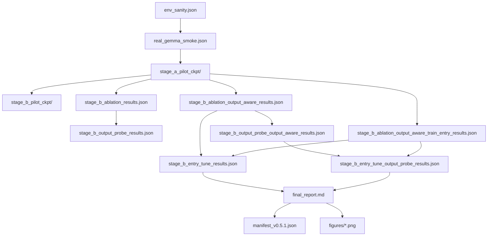

# Reproducibility Notes For v0.5.1

## Environment Assumptions

The frozen `v0.5.1` milestone assumes the real-hardware environment captured in `artifacts/env_sanity.json`:

- native Windows Python execution path
- Python `3.12.9`
- PyTorch `2.10.0.dev20251104+cu128`
- CUDA available on one NVIDIA GeForce RTX 5090
- total VRAM about `31.842 GB`
- BF16 available
- `transformers` `4.57.3`
- `bitsandbytes` `0.49.2`
- Hugging Face token present and Gemma access available for:
  - `google/gemma-2-9b`
  - `google/gemma-2-2b`

Operational notes:

- `USE_TF=0` and `USE_FLAX=0` were set in the native PowerShell wrappers.
- Hugging Face symlink warnings on Windows were treated as non-blocking.
- All frozen backbone weights remained frozen. No Stage C run is part of `v0.5.1`.

## Exact PowerShell Commands Used

These commands are recorded for provenance. `v0.5.1` does not require running new training or new evaluation.

Environment and smoke:

```powershell
powershell -ExecutionPolicy Bypass -File .\scripts\env_sanity.ps1
powershell -ExecutionPolicy Bypass -File .\scripts\real_gemma_smoke.ps1
```

Stage A pilot:

```powershell
powershell -ExecutionPolicy Bypass -File .\scripts\run_stage_a_pilot.ps1
```

Stage B hidden-only pilot:

```powershell
powershell -ExecutionPolicy Bypass -File .\scripts\run_stage_b_pilot.ps1 `
  -StageACheckpoint .\artifacts\stage_a_pilot_ckpt\stage_a_checkpoint.pt
```

Stage B hidden-only ablation and output probe:

```powershell
powershell -ExecutionPolicy Bypass -File .\scripts\run_stage_b_ablation.ps1 `
  -StageACheckpoint .\artifacts\stage_a_pilot_ckpt\stage_a_checkpoint.pt

powershell -ExecutionPolicy Bypass -File .\scripts\run_stage_b_output_probe.ps1
```

Stage B output-aware ablation:

```powershell
powershell -ExecutionPolicy Bypass -File .\scripts\run_stage_b_ablation.ps1 `
  -Config .\configs\gemma2_conservative_pilot_256_stage_b_output_aware.yaml `
  -StageACheckpoint .\artifacts\stage_a_pilot_ckpt\stage_a_checkpoint.pt
```

Stage B output-aware output probe:

```powershell
python -m src.eval.eval_stage_b_outputs `
  --config configs/gemma2_conservative_pilot_256_stage_b_output_aware.yaml `
  --ablation-dir artifacts/stage_b_ablation_output_aware `
  --ablation-results artifacts/stage_b_ablation_output_aware_results.json `
  --output-dir artifacts/stage_b_output_probe_output_aware `
  --results-path artifacts/stage_b_output_probe_output_aware_results.json `
  --summary-path artifacts/stage_b_output_probe_output_aware_summary.csv `
  --report-path notes/stage_b_output_probe_output_aware_report.md
```

Entry-projector finetune follow-up:

```powershell
powershell -ExecutionPolicy Bypass -File .\scripts\run_stage_b_entry_tune.ps1 `
  -StageACheckpoint .\artifacts\stage_a_pilot_ckpt\stage_a_checkpoint.pt
```

Freeze outputs:

```powershell
python -m src.tools.freeze_v051
```

## Artifact Dependency Graph



## Checkpoint Reuse And Run Lineage

- `artifacts/stage_a_pilot_ckpt/stage_a_checkpoint.pt` is the fixed initialization checkpoint for:
  - Stage B pilot
  - Stage B hidden-only ablation
  - Stage B output-aware ablation
  - Stage B entry-tune follow-up
- `artifacts/stage_b_output_probe_results.json` reuses the checkpoints produced by `artifacts/stage_b_ablation/`.
- `artifacts/stage_b_output_probe_output_aware_results.json` reuses the checkpoints produced by `artifacts/stage_b_ablation_output_aware/`.
- `artifacts/stage_b_entry_tune_results.json` compares:
  - frozen-entry output-aware Stage B reference results
  - entry-tuned Stage B follow-up results
- `artifacts/stage_b_entry_tune_output_probe_results.json` reuses:
  - frozen bridge controls from the output-aware ablation
  - tuned `hybrid` and `hybrid_no_small` checkpoints from the entry-tune raw run

## Frozen Configs

- Hidden-only pilot and hidden-only ablation:
  - `configs/gemma2_conservative_pilot_256.yaml`
- Output-aware Stage B:
  - `configs/gemma2_conservative_pilot_256_stage_b_output_aware.yaml`
- Entry-projector finetuning follow-up:
  - `configs/gemma2_conservative_pilot_256_stage_b_output_aware_train_entry.yaml`

## Release Guidance

`v0.5.1` is a write-up freeze. The milestone should be reproduced by inspecting the frozen artifacts and rerunning the figure/manifest generation step if needed, not by launching new experiments.
